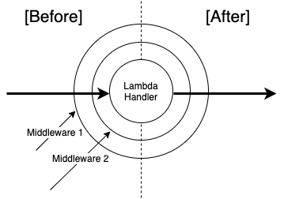

<div align="center">
  
  <p><strong>Elegant and modular middleware for AWS Lambdas with Golang</strong></p>
</div>

[](https://lgtm.com/projects/g/jpcedenog/gointercept/alerts/)
[](https://app.fossa.com/projects/git%2Bgithub.com%2Fjpcedenog%2Fgointercept?ref=badge_shield)

### About GoIntercept

A middleware layer allows developers to focus on the business logic when designing and implementing their core business logic. This way, additional functionality like authentication/authorization, input validation , serialization, etc. can be added in a modular and reusable way.

Web frameworks such as Echo, Spiral, Gin, among others, provide middleware functionality to wrap HTTP requests and thus provide additional features without polluting the core logic in the HTTP handler. 

GoIntercept is a simple but powerful middleware engine that simplifies the development of AWS Lambda functions implemented in Go.

### Quick Example

The simple example below shows the power of GoIntercept:

```go
package main

import (
	"context"
	"errors"
	"github.com/aws/aws-lambda-go/lambda"
	"github.com/jpcedenog/gointercept"
	"github.com/jpcedenog/gointercept/interceptors"
	"log"
)

type Input struct {
	Content string `json:"content"`
	Value   int    `json:"value"`
}

type Output struct {
	Status  string
	Content string
}

// Dummy function that succeeds or fails depending on the given input
func SampleFunction(context context.Context, input Input) (*Output, error) {
	if input.Value%2 != 0 {
		return nil, errors.New("passed incorrect value")
	} else {
		return &Output{
			Status:  "Success!",
			Content: input.Content,
		}, nil
	}
}

const (
	schema = `{
    "$id": "https://qri.io/schema/",
    "$comment" : "sample comment",
    "title": "Input",
    "type": "object",
    "properties": {
        "content": {
            "type": "string"
        },
        "value": {
            "description": "The Value",
            "type": "integer",
            "minimum": 0,
            "maximum": 2
        }
    },
    "required": ["content", "value"]
  }`
)

func main() {
	lambda.Start(gointercept.This(SampleFunction).With(
		interceptors.Notify("SampleFunction starts", "SampleFunction ends"),
		interceptors.CreateAPIGatewayProxyResponse(&interceptors.DefaultStatusCodes{Success: 200, Error: 400}),
		interceptors.AddHeaders(map[string]string{"Content-Type": "application/json", "company-header1": "foo1", "company-header2": "foo2"}),
		interceptors.AddSecurityHeaders(),
        interceptors.ValidateJsonSchema(schema),
		interceptors.ParseInput(&Input{}, false),
	))
}
```

### Usage

The example above shows that GoIntercept wraps around an existing Lambda Handler seamlessly. It is designed to get out of the way and remove all the boilerplate related to trivial and repetitive operations, such as: Logging, response formatting, HTTP header creation, input parsing and validation, etc.
 
The steps below describe the process to use GoIntercept:

1. Implement your Lambda Handler.
2. Import the *gointercept* and *gointercept/interceptors* packages.
3. In the *main()* function, wrap your Lambda handler with the *gointercept.This()* function.
4. Add all the required interceptors with the *.With()* method. **New interceptors are being added on a regular basis!**

#### Execution Order

GoIntercept is based on the [onion middleware pattern](https://esbenp.github.io/2015/07/31/implementing-before-after-middleware/). This means that each interceptor specified in the *With()* method wraps around the subsequent interceptor on the list, or the Lambda Handler itself when the last interceptor is reached.

<div align="center">
  
</div>

The sequence of interceptors, passed to the *.With()* method, specifies the order in which they are executed. This means that the last interceptor on the list runs just before the Lambda handler is executed . Additionally, each interceptor can contain at least one of three possible execution phases: *Before, After, and OnError.*

The *Before* phase runs before the following interceptor on the list, or the Lambda handler itself, runs. Note that in this phase the Lambda handler's response has not been created yet, so you will have access only to the request. 

The *After* phase runs after the following interceptor on the list, or the Lambda handler itself, has run. Note that in this phase the Lambda handler's response has already been created and is fully available.

As an example, if three middlewares have been specified and each has a *Before* and *After* phases, the steps below present the expected execution order:

Execution Step | Middleware | Phase
-------------- | ---------- | -----
1 | Middleware1 | Before
2 | Middleware2 | Before
3 | Middleware3 | Before
4 | Lambda Handler | N/A
5 | Middleware3 | After
6 | Middleware2 | After
7 | Middleware1 | After

#### Error Handling

Optionally, an interceptor can specify an *OnError* phase handler. This handler is triggered whenever an error is raised by the execution of any of the handler's phases(*Before* or *After*) or the Lambda handler itself.

If no *OnError* handler is specified and an error is raised, the error is simply passed as is to the parent handler (interceptor) or the method that called the Lambda handler.

### Custom Interceptors

Custom interceptors are simply instances of the *gointercept.Interceptor* struct. This struct allows to specify any of the phases executed by the interceptor which are, in turn, specified by the type *LambdaHandler*:

```go
type LambdaHandler func(context.Context, interface{}) (interface{}, error)

type Interceptor struct {
	Before  LambdaHandler
	After   LambdaHandler
	OnError ErrorHandler
}
```

All native interceptors are implemented as a function that returns an instance of *gointercept.Interceptor*. This offers the advantage of specifying configuration parameters that are needed by the interceptor (see the *.AddHeaders* interceptor in the example above).

### Available Middlewares

Name | Phases | Description
---- | ------ | -----------
Notify | Before and After | Used for logging purposes. It prints the two given messages during the *Before* and *After* phases respectively.
CreateAPIGatewayProxyResponse | After or OnError | Formats the output or error of the Lambda handler as an instance of [API Gateway Proxy Response](https://godoc.org/github.com/aws/aws-lambda-go/events#APIGatewayProxyResponse)
AddHeaders | After | Adds the given HTTP headers (provided as key-value pairs) to the response. It converts the response to an APIGatewayProxyResponse if it is not already one
ParseInput | Before | Reads the JSON-encoded payload (request) and stores it in the value pointed to by its input
AddSecurityHeaders | After | Adds the default security HTTP headers (provided as key-value pairs) to the response. It converts the response to an APIGatewayProxyResponse if it is not already one. These headers follow security best practices, similar to what is done by [HelmetJS](https://helmetjs.github.io/)
ValidateJsonSchema | After | Validates the payload against the given JSON schema. For more information check [qrio.io's JsonSchema](https://github.com/qri-io/jsonschema)

### Contributing

Everyone is welcome to contribute to this repository. Feel free to raise issues or to submit Pull Requests.

### License


[](https://app.fossa.com/projects/git%2Bgithub.com%2Fjpcedenog%2Fgointercept?ref=badge_large)